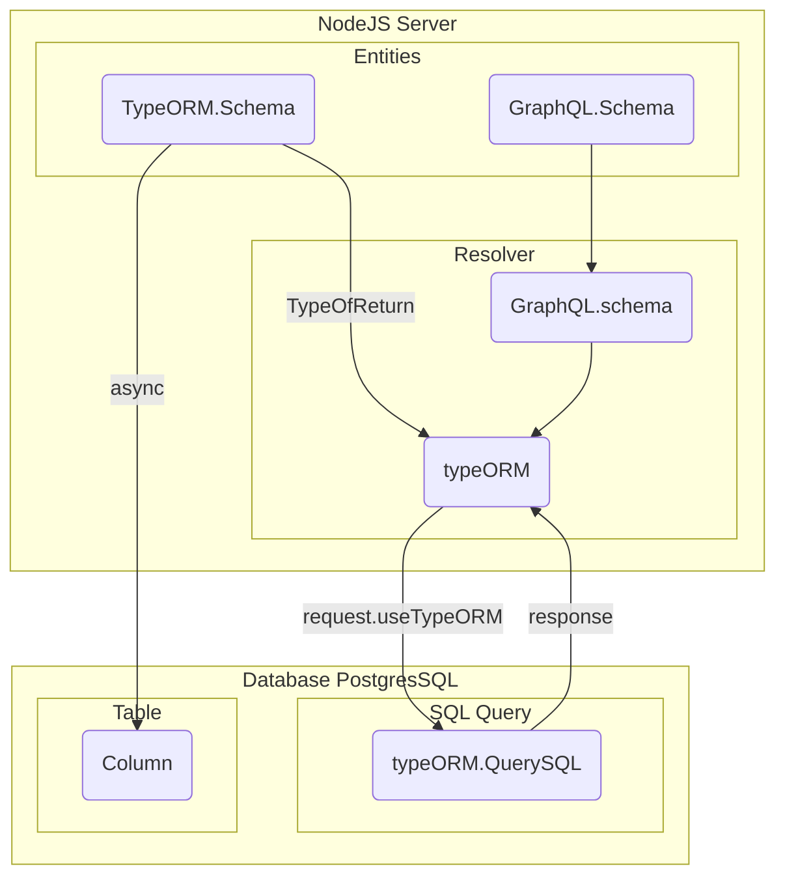

### How to start server?

1.Open terminal
2.yarn watch
3.Open one more terminal
4.yarn server

```mermaid
graph TD;
   A-->|request.useTypeORM|B
   B-->|response|A
   D-->|async| C
   D-->|TypeOfReturn|A
   E-->F
   F-->A
  subgraph NodeJS Server

    subgraph Resolver
    A(typeORM)
    F(GraphQL.schema)
    end

    subgraph Entities
      D(TypeORM.Schema)
      E(GraphQL.Schema)
    end

  end

  subgraph Database PostgresSQL

    subgraph SQL Query
    B(typeORM.QuerySQL)
    end

    subgraph Table
    C(Column)
    end

  end
```
